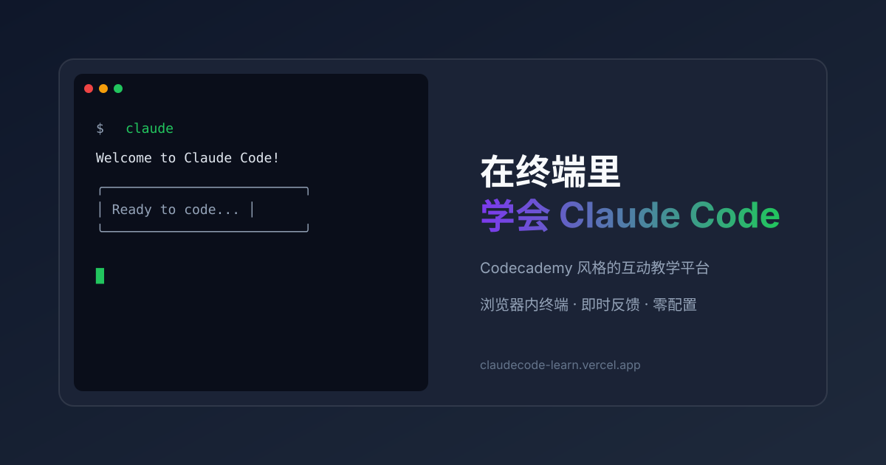

# ClaudeCode Learn

<p align="center">
  
</p>

<p align="center">
  <strong>一个 Codecademy / Scrimba 风格的 Claude Code 互动教学平台</strong>
</p>

<p align="center">
  <a href="https://github.com/DoubleTuTu/claude-code-web-interactive-learn/actions">
    
  </a>
  <a href="https://github.com/DoubleTuTu/claude-code-web-interactive-learn/releases">
    
  </a>
  <a href="https://github.com/DoubleTuTu/claude-code-web-interactive-learn/blob/main/LICENSE">
    
  </a>
  <a href="https://github.com/DoubleTuTu/claude-code-web-interactive-learn/stargazers">
    
  </a>
  <a href="https://github.com/DoubleTuTu/claude-code-web-interactive-learn/network/members">
    
  </a>
</p>

<p align="center">
  <a href="#快速开始">快速开始</a> •
  <a href="#特性">特性</a> •
  <a href="#课程内容">课程内容</a> •
  <a href="#截图">截图</a> •
  <a href="#贡献">贡献</a> •
  <a href="#许可证">许可证</a>
</p>

---

## 目录

- [简介](#简介)
- [特性](#特性)
- [截图](#截图)
- [快速开始](#快速开始)
- [技术栈](#技术栈)
- [项目结构](#项目结构)
- [课程内容](#课程内容)
- [学习路径](#学习路径)
- [模板和配置](#模板和配置)
- [示例项目](#示例项目)
- [部署](#部署)
- [贡献](#贡献)
- [许可证](#许可证)
- [致谢](#致谢)

---

## 简介

**ClaudeCode Learn** 是一个互动教学平台，让你在浏览器中通过实际操作学习 Claude Code。无需安装任何软件，打开浏览器就能开始学习。

> 💡 **适合人群**: 想要学习 Claude Code 的开发者、想要构建 AI Agent 的工程师、想要了解 AI 编程助手的技术爱好者

### 为什么选择这个平台？

- ✅ **零配置** - 打开浏览器就能学
- ✅ **边学边做** - 真实终端模拟，不是看视频
- ✅ **即时反馈** - 每一步都告诉你对不对
- ✅ **碎片化学习** - 5 分钟一课，随时随地
- ✅ **完全免费** - 开源项目，MIT 许可证

---

## 特性

### 核心功能

| 特性 | 描述 |
|------|------|
| 🖥️ **真实终端体验** | 基于 xterm.js 的终端模拟器，绿色光标闪烁，完全还原真实终端 |
| ✅ **即时反馈** | 每完成一步立刻告诉你对不对，三次机会后显示答案 |
| 💾 **自动保存进度** | 关掉浏览器没关系，下次打开继续学 |
| 📱 **响应式设计** | 支持桌面和移动端，随时随地学习 |
| 🌙 **深色主题** | 开发者友好的深色 UI，保护眼睛 |
| 🎯 **步骤引导** | 每节课分解为多个小步骤，循序渐进 |

### 教学特色

| 特色 | 描述 |
|------|------|
| 🎓 **渐进式学习** | 从入门到高级，逐步深入 |
| 🧠 **心智模型** | 先建立概念理解，再动手实践 |
| 🔧 **实战导向** | 每个概念都有对应的终端练习 |
| 📊 **知识测验** | 互动测验检验学习效果 |
| 🎨 **动画演示** | 复杂概念用动画可视化 |

---

## 截图

> 💡 **提示**: 运行 `pnpm dev` 后访问 https://claude-code-web-interactive-learn.vercel.app 查看实际效果。截图稍后补充。

---

## 快速开始

### 前置要求

- **Node.js** 18.0 或更高版本
- **pnpm** 8.0 或更高版本（推荐）或 npm/yarn

### 安装

```bash
# 1. 克隆仓库
git clone https://github.com/DoubleTuTu/claude-code-web-interactive-learn.git
cd claude-code-web-interactive-learn

# 2. 安装依赖
pnpm install

# 3. 启动开发服务器
pnpm dev
```

### 访问

打开浏览器访问 https://claude-code-web-interactive-learn.vercel.app

### 其他命令

```bash
# 运行测试
pnpm test

# 类型检查
pnpm typecheck

# 代码检查
pnpm lint

# 构建生产版本
pnpm build

# 预览生产版本
pnpm start
```

---

## 技术栈

<p align="center">
  <a href="https://nextjs.org">
    
  </a>
  <a href="https://www.typescriptlang.org">
    
  </a>
  <a href="https://tailwindcss.com">
    
  </a>
  <a href="https://xtermjs.org">
    
  </a>
  <a href="https://www.framer.com/motion">
    
  </a>
</p>

| 技术 | 版本 | 用途 |
|------|------|------|
| **Next.js** | 16.x | React 框架，App Router |
| **TypeScript** | 5.x | 类型安全 |
| **Tailwind CSS** | 4.x | 样式系统 |
| **xterm.js** | 6.x | 终端模拟 |
| **Framer Motion** | 12.x | 动画库 |
| **Vitest** | 4.x | 单元测试 |
| **Playwright** | 1.x | E2E 测试 |
| **pnpm** | 9.x | 包管理器 |

---

## 项目结构

```
claude-code-web-interactive-learn/
├── .github/                    # GitHub 配置
│   └── workflows/              # CI/CD 工作流
├── docs/                       # 文档
│   └── screenshots/            # 截图和 GIF
├── examples/                   # 示例项目
│   ├── agent-loop/             # Agent Loop 示例
│   ├── claude-md-config/       # CLAUDE.md 配置示例
│   └── mcp-config/             # MCP 配置示例
├── public/                     # 静态资源
│   ├── templates/              # 模板文件
│   └── og-image.svg            # Open Graph 图片
├── src/
│   ├── app/                    # Next.js App Router
│   │   ├── layout.tsx          # 根布局
│   │   ├── page.tsx            # 首页
│   │   └── lessons/[id]/       # 课程页面
│   ├── components/             # React 组件
│   │   ├── Terminal.tsx        # xterm.js 终端组件
│   │   ├── StepEngine.tsx      # 步骤引擎
│   │   ├── LessonLayout.tsx    # 课程布局
│   │   ├── MarkdownRenderer.tsx # Markdown 渲染
│   │   └── animations/         # 动画组件
│   ├── data/                   # 课程数据
│   │   └── courses.json        # 课程配置
│   ├── lib/                    # 工具函数
│   │   ├── course-loader.ts    # 课程加载器
│   │   ├── progress.ts         # 进度管理
│   │   └── constants.ts        # 常量
│   └── types/                  # TypeScript 类型
│       └── lesson.ts           # 课程类型定义
├── e2e/                        # E2E 测试
├── next.config.ts              # Next.js 配置
├── tsconfig.json               # TypeScript 配置
├── vitest.config.mts           # Vitest 配置
├── playwright.config.ts        # Playwright 配置
└── package.json                # 项目配置
```

---

## 课程内容

目前包含 **20 节课程**，覆盖三个学习阶段：

### 📚 入门 (Level 1)

| 课程 | 主题 | 难度 | 时长 |
|------|------|------|------|
| l1-1 | 什么是 Claude Code | ⭐ | 5 分钟 |
| l1-2 | 安装 Claude Code | ⭐ | 5 分钟 |
| l2-1 | 第一次对话 | ⭐ | 5 分钟 |
| s01 | Agent 循环 | ⭐ | 10 分钟 |
| s02 | 工具调用 | ⭐ | 10 分钟 |
| s03 | TodoWrite | ⭐ | 10 分钟 |
| s04 | 子代理 | ⭐ | 10 分钟 |
| s05 | 技能加载 | ⭐ | 10 分钟 |
| s06 | 上下文压缩 | ⭐ | 10 分钟 |

### 🚀 进阶 (Level 2)

| 课程 | 主题 | 难度 | 时长 |
|------|------|------|------|
| l3-1 | TDD 工作流 | ⭐⭐ | 15 分钟 |
| s07 | 任务系统 | ⭐⭐ | 15 分钟 |
| s08 | 后台任务 | ⭐⭐ | 15 分钟 |
| s09 | Agent 团队 | ⭐⭐ | 15 分钟 |
| s10 | 团队协议 | ⭐⭐ | 15 分钟 |
| s11 | 自主 Agent | ⭐⭐ | 15 分钟 |
| s12 | Worktree 隔离 | ⭐⭐ | 15 分钟 |

### 🎓 高级 (Level 3)

| 课程 | 主题 | 难度 | 时长 |
|------|------|------|------|
| s13 | CLAUDE.md 配置 | ⭐⭐⭐ | 20 分钟 |
| s14 | Hooks 事件自动化 | ⭐⭐⭐ | 20 分钟 |
| s15 | MCP 集成 | ⭐⭐⭐ | 20 分钟 |
| s16 | 权限系统 | ⭐⭐⭐ | 20 分钟 |

---

## 学习路径

```
┌─────────────────────────────────────────────────────────────┐
│                      学习路径                                │
├─────────────────────────────────────────────────────────────┤
│                                                             │
│  入门 (Level 1)                                              │
│  ├── Agent Loop 核心循环                                     │
│  ├── 工具系统                                                │
│  ├── 子代理                                                  │
│  └── 上下文管理                                              │
│       ↓                                                     │
│  进阶 (Level 2)                                              │
│  ├── TDD 工作流                                              │
│  ├── 任务系统                                                │
│  ├── 团队协作                                                │
│  └── 自主 Agent                                              │
│       ↓                                                     │
│  高级 (Level 3)                                              │
│  ├── CLAUDE.md 配置                                          │
│  ├── Hooks 自动化                                            │
│  ├── MCP 集成                                                │
│  └── 安全与权限                                              │
│                                                             │
└─────────────────────────────────────────────────────────────┘
```

---

## 模板和配置

项目提供实用的模板文件，位于 `public/templates/`：

| 模板 | 描述 | 位置 |
|------|------|------|
| **CLAUDE.md** | 项目配置模板 | `public/templates/CLAUDE.md` |
| **settings.json** | 权限、Hooks、MCP 配置示例 | `public/templates/settings.json` |
| **commands.md** | 常用命令参考手册 | `public/templates/commands.md` |

### 使用方法

```bash
# 复制 CLAUDE.md 到你的项目
cp public/templates/CLAUDE.md /path/to/your/project/

# 复制 settings.json 到你的项目
cp public/templates/settings.json /path/to/your/project/.claude/
```

---

## 示例项目

在 `examples/` 目录中提供了三个示例项目：

### 1. Agent Loop 示例

```bash
cd examples/agent-loop
pip install -r requirements.txt
python agent_loop.py
```

**功能**: 演示 Claude Code 的核心机制 - Agent Loop

### 2. CLAUDE.md 配置示例

```bash
cd examples/claude-md-config
cat nextjs-project/CLAUDE.md
```

**功能**: 展示如何为不同项目配置 CLAUDE.md

### 3. MCP 配置示例

```bash
cd examples/mcp-config
cat settings.json
```

**功能**: 展示如何配置 MCP 服务器

---

## 部署

### Vercel (推荐)

[](https://vercel.com/new/clone?repository-url=https://github.com/DoubleTuTu/claude-code-web-interactive-learn)

```bash
# 安装 Vercel CLI
npm i -g vercel

# 部署
vercel
```

### 其他平台

项目支持任何支持 Next.js 的部署平台：
- Netlify
- AWS Amplify
- Railway
- Render

---

## 贡献

欢迎贡献！请遵循以下步骤：

### 1. Fork 仓库

```bash
# 点击页面右上角的 Fork 按钮
```

### 2. 克隆到本地

```bash
git clone https://github.com/DoubleTuTu/claude-code-web-interactive-learn.git
cd claude-code-web-interactive-learn
```

### 3. 创建特性分支

```bash
git checkout -b feature/AmazingFeature
```

### 4. 提交更改

```bash
git commit -m 'Add some AmazingFeature'
```

### 5. 推送到分支

```bash
git push origin feature/AmazingFeature
```

### 6. 创建 Pull Request

```bash
# 点击页面上的 "New Pull Request" 按钮
```

### 贡献指南

- 📖 **添加课程**: 在 `src/data/courses.json` 中添加新课程
- 🐛 **修复 Bug**: 提交 Issue 并修复
- 📝 **改进文档**: 更新 README 或添加注释
- 🎨 **优化 UI**: 改进样式或动画

详细格式请参考 `src/types/lesson.ts` 和 [CONTRIBUTING.md](CONTRIBUTING.md)

---

## 许可证

本项目采用 MIT 许可证 - 详见 [LICENSE](LICENSE) 文件

---

## 致谢

- [Claude Code](https://docs.anthropic.com/claude-code) - Anthropic 官方的命令行 AI 助手
- [Next.js](https://nextjs.org) - React 框架
- [xterm.js](https://xtermjs.org) - 终端模拟器
- [Tailwind CSS](https://tailwindcss.com) - CSS 框架
- [Framer Motion](https://www.framer.com/motion) - 动画库

---

## 支持

如果你觉得这个项目对你有帮助，请考虑：

⭐ **给个 Star** - 点击页面右上角的 Star 按钮

🐛 **报告 Bug** - 提交 Issue

💡 **提出建议** - 提交 Feature Request

---

<p align="center">
  Made with ❤️ by <a href="https://github.com/DoubleTuTu">DoubleTuTu</a>
</p>
